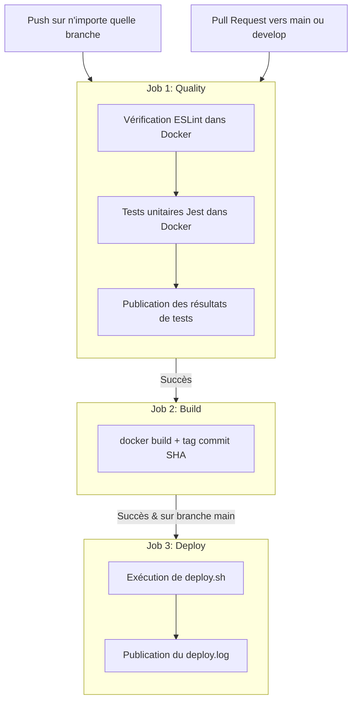

# SkillHub API — starter EC06

Mini API Express (Node.js 20) qui sert de base à l'épreuve EC06.

## Endpoints

- `GET /` : message d'accueil.
- `GET /health` : retourne le statut de l'API.

## Scripts npm

```bash
npm install            # installer les dépendances
npm start              # démarrer le serveur sur le port 3000
npm test               # lancer la suite de tests Jest
npm run lint           # vérifier le code avec ESLint
```

## À noter

Ce starter contient une mini-app Express fonctionnelle, **2 tests Jest qui passent**, et une config ESLint minimale. **Tout passe au vert dès le départ** — l'épreuve évalue votre capacité à mettre en place la chaîne CI/CD autour de cette app, pas à coder en Node.

Ce starter ne contient **ni** `Dockerfile`, **ni** `docker-compose.yml`, **ni** `.gitignore`, **ni** workflow CI. C'est à vous de tout ajouter pendant l'épreuve.

## Pré-requis

- Node.js 20+
- Docker et Docker Compose (à utiliser une fois que vous aurez écrit votre `Dockerfile` et `docker-compose.yml`)

## Stratégie de branches (GitFlow)

Pour ce projet, nous mettons en place une stratégie **GitFlow simplifiée**. 

### Justification de la stratégie
Le choix de GitFlow simplifiée se justifie par le besoin d'avoir une séparation claire entre la production (`main`), la branche d'intégration de développement (`develop`), et les tâches en cours (`feature/*`). Cela permet de garantir que la branche `main` reste toujours stable et testée, tout en permettant aux développeurs de travailler de manière isolée sur leurs fonctionnalités avant de les intégrer.

### Structure des branches
- **`main`** : Branche de production. Elle contient le code stable et prêt à être déployé. Tout push direct y est interdit.
- **`develop`** : Branche principale de développement et d'intégration. Les fonctionnalités terminées et testées y sont fusionnées.
- **`feature/<nom>`** : Branches éphémères créées depuis `develop` pour le développement d'une fonctionnalité spécifique (ex : `feature/dockerfile`, `feature/ci-pipeline`). Elles sont ensuite fusionnées dans `develop` via une Pull Request (PR).

### Protection de la branche `main`
La branche `main` est configurée avec les règles de protection suivantes sur GitHub (décrites ici à défaut de pouvoir être totalement appliquées sans droits administrateur avancés) :
1. **Require a pull request before merging** : Interdiction de push directement sur `main`. Tout changement doit obligatoirement faire l'objet d'une Pull Request (PR).
2. **Require status checks to pass before merging** : Les jobs de lint et de tests de la CI doivent obligatoirement être au vert (success) avant de pouvoir fusionner la PR.
3. **Restrict who can push to matching branches** : Seuls les administrateurs et leads du projet peuvent fusionner la PR une fois toutes les conditions remplies.

## Conteneurisation (Docker)

### Description du Dockerfile Multi-stage
Notre `Dockerfile` est structuré en deux étapes pour optimiser la sécurité et la taille de l'image finale :
1. **Étape `builder`** : Utilise l'image `node:20-alpine` pour copier les fichiers du projet et exécuter `npm ci`, installant ainsi toutes les dépendances (y compris les outils de test et de lint requis pour la CI).
2. **Étape finale** : Utilise également `node:20-alpine` pour une légèreté maximale (taille finale d'environ 50 Mo, bien en dessous du bonus de 200 Mo). Elle n'installe que les dépendances de production (`npm ci --only=production`) et récupère uniquement le code source nécessaire (`/src`) depuis le constructeur.
   - **Utilisateur non-root** : L'instruction `USER node` est explicitement déclarée pour exécuter le conteneur avec des privilèges restreints.
   - **Exposition du port** : Le port `3000` est formellement exposé via l'instruction `EXPOSE 3000`.
   - **HEALTHCHECK** : Défini via `wget` pour tester périodiquement l'état de l'endpoint `/health` :
     `HEALTHCHECK --interval=30s --timeout=5s --start-period=5s --retries=3 CMD wget --no-verbose --tries=1 --spider http://localhost:3000/health || exit 1`

### Description de docker-compose
Le fichier `docker-compose.yml` permet de démarrer l'ensemble de la stack locale avec la commande `docker compose up`. Il comprend :
- **`app`** : Le service Node.js construit localement à partir du `Dockerfile`, exposant le port configuré via la variable `PORT` (par défaut 3000) et dépendant du démarrage sain (`service_healthy`) de la base de données.
- **`db`** : Un conteneur PostgreSQL (`postgres:15-alpine`) intégrant un test de santé (`pg_isready`) et des variables d'environnement configurées via un fichier `.env`.
- **Persistance** : Un volume nommé `pgdata` monté sur `/var/lib/postgresql/data` pour conserver les données de la base de données après l'arrêt des conteneurs.
- **Gestion de la configuration** : Chargement des variables d'environnement via la directive `env_file` pointant sur `.env`. Le fichier `.env` est ignoré par Git (défini dans `.gitignore`), tandis qu'un modèle `.env.dist` est versionné.

## Architecture du Pipeline CI/CD

Le pipeline CI/CD est implémenté avec **GitHub Actions** (`.github/workflows/ci.yml`) et s'articule autour de trois jobs : `quality`, `build` et `deploy`.

### Schéma du workflow (Mermaid)



### Détails des jobs
1. **Quality (Lint + Test)** : 
   - S'exécute sur toutes les branches à chaque push et Pull Request.
   - Initialise le fichier `.env` à partir de `.env.dist`.
   - Lance ESLint et Jest **à l'intérieur du conteneur Docker** via `docker compose run --rm app`.
   - Exporte et publie les logs de tests comme artefact GitHub (`test-results`).
2. **Build** :
   - S'exécute uniquement si le job `quality` réussit.
   - Construit l'image Docker de production et lui attribue deux tags : le SHA court du commit actuel et `latest`.
3. **Deploy (Simulé)** :
   - Déclenché uniquement sur la branche `main` après réussite du build.
   - Exécute le script `deploy.sh` qui simule le déploiement local de l'application et exporte le fichier `deploy.log` comme artefact.


